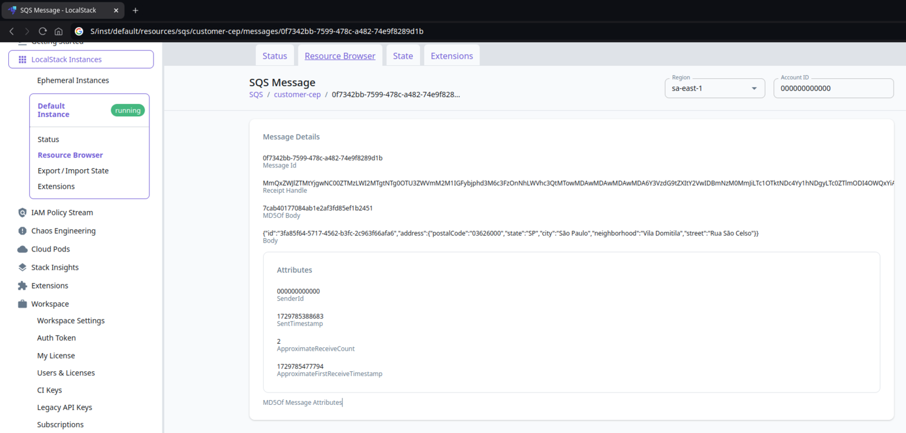

# CepToAddress

## Description
This application have the purpose to receive a customer and its PostalCode (CEP in Brazil)
and transform it in a valid Address using the [BrasilAPI](https://brasilapi.com.br/) to do so.

Each call to `BrasilAPI` will be saved in a database.

Also it puts the data retrieved to a sqs queue, called `customer-cep`


## Run Local
In order to run local you should have [Docker](https://www.docker.com/) installed.

After that, you can enter inside `local` folder, and run

```shell
docker compose up -d
```

it will be created a mysql, a localstack and a wiremock container.

After build this app with [Maven](https://maven.apache.org/) and `Java 21`, you will be able to run it.
You should set the following env vars (you can check the values in `docker-compose.yml`)

```shell
AWS_ACCESS_KEY_ID=test
AWS_SECRET_ACCESS_KEY=test
```
You should set as well the spring-profile in order to run local:
```shell
java -jar ... -Dspring.profiles.active=local ... 
```

You can see a swagger-ui if you click [here](http://localhost:8081/). 

Use `Try it out` button to send some message to endpoint. You can see endpoints documentation in Swagger as well.

You can see the message created on localstack by entering the [Localstack](https://app.localstack.cloud/).



## Modules
This application uses the `Hexagonal Architecture`, and have some modules to do so.

### ceptoaddress-application
Just the Spring Boot Application main. Its pom do the job of mix all the classes, by importing all the modules inside
it.

### ceptoaddress-business
This module knows how the application should use the other modules to have what is needed. Works exactly as any other module,
but it searches for the other modules to do what only the other modules methods do, like an orchestrator.

### ceptoaddress-core
A module that shares with other modules the uses cases. Every module should expose its methods by implementing an interface
that is present at core module. 

### ceptoaddress-domain
A module that shares with other modules the data. Every module should pass its information by using a domain object.

### ceptoaddress-gateway
Controller with endpoint `POST /ceptoaddress/`, which receives a json, like the following:
```json
{
  "customerId": "9061c406-3c44-454e-827b-d2a1d448fd67",
  "postalCode": "00000000"
}
```
This json will be enriched with address info in business module.

### ceptoaddress-postalcode-client
This module is responsible for managing the communication with the postalcode provider, in this case, [BrasilAPI CEP V2](https://brasilapi.com.br/docs#tag/CEP-V2)
Based on a postal code, it returns all the other information.

### ceptoaddress-messaging-sqs
This module manages the post to sqs queue `customer-cep`.